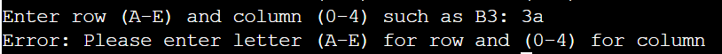

Battleship is a war-themed board game. In this single-player version of Battleship, the player would play against a computer or virtual opponent. The goal is to sink all of the ships before the player run out of his bullets, but the challenge lies in the unpredictability of the ship placement and its guessing strategy. 

This Battleship game is a Python terminal game which is hosted on Heroku. The live link can be found [here](https://battleship-game01-68bd5cc1b953.herokuapp.com/)

# Contents

* [How to Play](<#How-To-Play>)
* [Features](#Features)
  * [Existing Features](#Existing-Features)
  * [Future Features](#Future-Features)
* [Technologies](#Technologies)
* [Data Model](#Data-Model)
* [Testing](#Testing)
  * [PEP8 Validation](#pep8-validation)
  * [Bugs](#bugs)
* [Deployment](#Deployment)
* [Credits](#credits)
* [Acknowledgement](#acknowledgement)

# How To Play

* Game Setup: The game is played on a 5x5 grid. Three ships of variable lengths are randomly placed on the grid. The goal is to sink all the ships within the given number of bullets.
* Ammunition: The player is provided with 10 bullets at the start of the game.
* Taking a Shot: To take a shot, choose a row and column on the grid. For example, B3 indicates the second row in the fourth column.
* Hit or Miss: After each shot, the grid will be updated to show whether the shot was a hit or a miss.
* Grid Legend:
  * (".") : Water or empty space
  * ("X") : A ship that has been hit
  * ("#") : Shot in the water, indicating a miss
* Ship Direction: The ship will be in one of four directions: left, right, up, or down. Ships cannot be placed diagonally.

* Winning and Losing:
The player will win by sinking all ships before running out of bullets.
The game is lost if the player is run out of bullets before sinking all ships.

[Back to top](<#contents>)

# Features
## Existing Features
* Getting Started

To create excitement for a war game, battleship art is displayed at the beginning of the game and the player is greeted as a 'Admiral'.

 

* Initial Setup:
  * Upon starting, a 5x5 grid is displayed with ships randomly placed.
  * Each cell on the grid is denoted by a period ("."), representing water.
  * Grids are formed with Rows from A-E and Columns from 0-4 as game cordinates. 
  * There are 10 bullets to shoot at the ships. 
  * Ship positions are concealed from the player.

* Grid Representation:
The game grid displays hits, misses, number of bullets left and remaining ships after each bullet is shot. Final grid is displayed at the end of the game.

* Player feedback: 
Feedback is constantly displayed to the player during the game.
The player must enter coordinates to start and continue the game. They enter a row or y-axis cordinate (A-E) first, followed by a column or x-axis coordinate (0-4). 

If they enter invalid values, they are prompted to enter a valid one. 

After entering the correct coordinates, the player receives feedback. The feedback indicates whether they hit or missed the ship.

* Players can shoot bullets by specifying a position (e.g., "B3"), and the grid is updated accordingly.

* Ship Sinking Recognition:
The game recognizes when a ship is completely sunk after a successful hit.

* Game Over Conditions: 
  * The game ends when all ships are sunk, resulting in a victory. The final grid is displayed along with a victory or defeat message.

  

  * The game also ends if the player runs out of bullets, resulting in a defeat.

   

[Back to top](<#contents>)

## Future Features

* User Interface (UI): To develop a graphical user interface (GUI) to enhance the overall gaming experience.

* Multiplayer Mode: To introduce a multiplayer mode where players can compete against each other in real-time.

* Difficulty Levels: To implement multiple difficulty levels with varying grid sizes, ship numbers, and bullet limits to cater to different player preferences.

* Customizable Grids: To enable players to customize the grid size and ship placement for a more personalized gaming experience.

* Ship Types and Sizes: To expand ship variety by introducing different types with unique sizes, adding complexity to the gameplay.

* Score Tracking: To implement a scoring system to track and display the player's performance across multiple game sessions.

* Save and Load Games: To allow players to save their game progress and resume at a later time.

* Achievements and Challenges: To introduce in-game achievements and challenges to provide additional goals for players to strive for.

[Back to top](<#contents>)

# Technologies

* Python: The programming language used for developing this Battleships game. Python provides simplicity and versatility.

* Gitpod: Gitpod was utilized as the integrated development environment (IDE) for coding and testing the application. Its cloud-based nature allows for seamless and efficient development workflows.

* GitHub : GitHub serves as the version control platform for the project, enabling version tracking, and code management. The repository is hosted on GitHub.

* Heroku : Heroku is employed for deploying and hosting the Battleship game application, allowing for easy deployment and accessibility.

* ASCII Art: ASCII art is used to enhance the visual appeal of the game. The battleship_art module includes ASCII art representations, adding a creative touch to the game interface.

[Back to top](<#contents>)

# Data Model

The project utilizes a simple grid-based data model to represent the game environment. The key components include:

## Grid Representation:

The game grid is a 5x5 matrix represented by a list of lists.
Each cell in the grid represents a position on the battlefield and can be in one of the following states:

- (".") : Water or empty space.
- ("X"):  Ship has been hit with a bullet.
- ("#"): Shot in the water, indicating a miss because it hit no ship.

## Global Variables:

**grid_size** : An integer specifying the size of the grid (5x5 in this case).

**num_of_ships** : An integer representing the number of ships in the game (default is 3).

**bullets_left** : An integer indicating the number of bullets remaining for the player (starts at 10).

**game_over** : A boolean flag to determine whether the game is over or not.

**num_of_ships_sunk** : An integer tracking the number of ships that have been completely sunk.

**ship_positions** : A list containing the positions of the ships on the grid.

[Back to top](<#contents>)

# Testing

## PEP 8 Validation
* I've conducted manual testing on this project, carrying out the following steps:

   - Ran the code through a PEP8 linter and verified that there are no critical issues.
   - Provided invalid inputs, such wrong combination, inputs beyond specified bounds, and repeating the same input.
   - Conducted testing in both my local terminal and the Code Institute Heroku terminal.

## Bugs

### Solved Bugs

* Bullet Placement Validation : Fixed an issue where the bullet placement validation did not handle uppercase and lowercase letters uniformly.

* Game Over Display : The game over display was not appear as expected. Issuse was fixed.

### Remaining Bugs

*  No bugs remaining

### Validator Testing
 
 * PEP8 : No critical errors found.

[Back to top](<#contents>)

# Deployment

This project was deployed using Code Institute's simulated terminal for Heroku.

Steps for deployment is as follows ;

* Setup Account on Heroku : Create a Heroku account if not already done.

* Create a New App : 
    - Log in to the Heroku dashboard.
    - Click the "Create new app" button.
    - Provide a name for the app.
    - Click "Create app."

* App Configuration:
    - Navigate to the "Settings" tab.
    - Set the configuration variables (config vars):
        - Key: PORT, 
        - Value: 8000

* Build the App: Heroku will automatically build the app using the code from the linked GitHub repository.

* Add Buildpacks : In the "Settings" tab, scroll down to the "Buildpacks" section.
    - Click "Add buildpack."
    - Add the Python buildpack and save changes.
    - Add the node.js buildpack and save changes.

Ensure the buildpacks are in the following order: Python (top) and node.js (underneath).

* Deployment Section:
    - Go to the "Deploy" section.
    - Choose Deployment Method:
    - Under "Deployment method," select GitHub.
    - Click the "Connect to GitHub" button.
    - Search for the GitHub repository name.
    - Click "Connect" to link the Heroku app to the GitHub repository code.

* Deployment Options : Choose either automatic or manual deployment using the main branch.
    - Manual Deployment (Optional): If manual deployment is chosen, click "Deploy" to initiate the deployment process.

* Deployment Confirmation : After deployment, "App was successfully deployed" message is displayed.

* Accessing the App : App can be accesed by clicking on the link.

* Running the App: The mock terminal will be up and running automatically. Restart the game anytime by clicking the 'RUN PROGRAM' button.

[Back to top](<#contents>)

# Credits

* GitHub template came from [Code Institute](https://codeinstitute.net/global/).

* [Stack OverFlow](https://stackoverflow.com/)

* [Dr. Angela Yu](https://www.udemy.com/course/100-days-of-code/)

* [ASCII Art ](https://ascii.co.uk/art)

# Acknowledgement

* The tutors, mentors and cohort facilator at Code Institute.
* This game is built as part of my project for the Full Stack Software Development Diploma at the Code Institute.

[Back to top](<#contents>)

